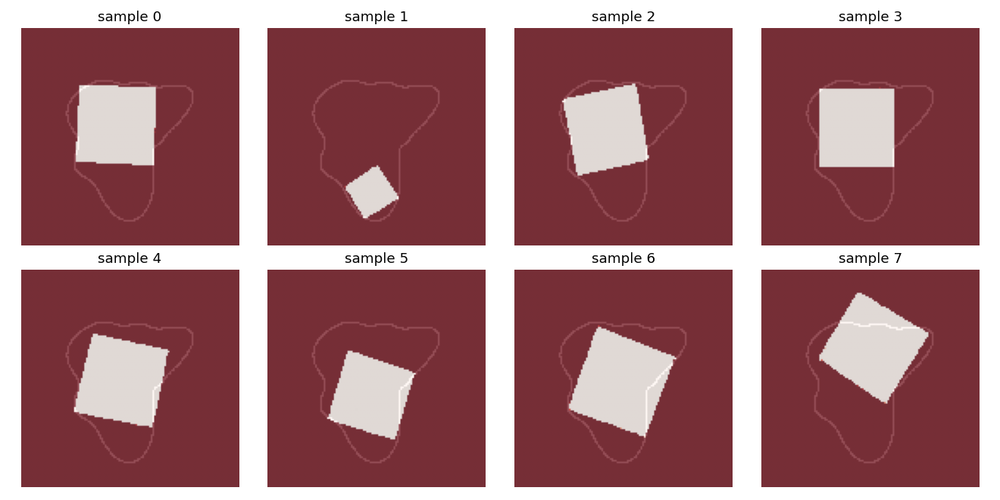

# Inscribed Squares from Noise

A marimo notebook walkthrough of *Visual Diffusion Models are Geometric Solvers*
(Goren et al., CVPR 2026 Highlight, [arXiv 2510.21697](https://arxiv.org/abs/2510.21697))
— submitted to the
[alphaXiv × marimo "Bring Research to Life"](https://marimo.io/pages/events/notebook-competition)
competition.

## What's inside

A 128×128 image diffusion model takes a Jordan curve as input and denoises
Gaussian noise into a picture of an inscribed square. Same curve + different
seeds → different inscribed squares, sweeping the multimodal solution
family.



## Run it

- **In your browser** (via molab WASM, no install): open the notebook on
  molab and append `/wasm`.
- **Locally**:
  ```bash
  uv venv .venv && source .venv/bin/activate
  uv pip install marimo numpy scipy matplotlib pillow
  marimo edit notebooks/inscribed_squares.py
  ```

## Re-running the diffusion sampling yourself

The notebook reads precomputed samples from `data/gallery.npz`. To regenerate:

```bash
git clone https://github.com/kariander1/visual-geo-solver.git
huggingface-cli download nirgoren/geometric-solver \
  checkpoints_curves/checkpoint_520.pth \
  --local-dir cache/checkpoints
uv pip install torch torchvision opencv-python omegaconf tqdm scikit-image
python scripts/precompute.py
```

Sampling takes ~5 seconds per square on a modern laptop CPU, ~8 minutes for
the full gallery (5 curves × 8–16 seeds).

## Repo layout

```
notebooks/inscribed_squares.py   # the submission
scripts/precompute.py            # offline diffusion sampling
data/gallery.npz                 # precomputed samples (10 MB)
assets/hero_8_squares.png        # hero image used in the notebook header
```

## Citation

```
@misc{goren2025visualdiffusionmodelsgeometric,
  title  = {Visual Diffusion Models are Geometric Solvers},
  author = {Nir Goren and Shai Yehezkel and Omer Dahary and Andrey Voynov
            and Or Patashnik and Daniel Cohen-Or},
  year   = {2025},
  eprint = {2510.21697},
  archivePrefix = {arXiv},
}
```
